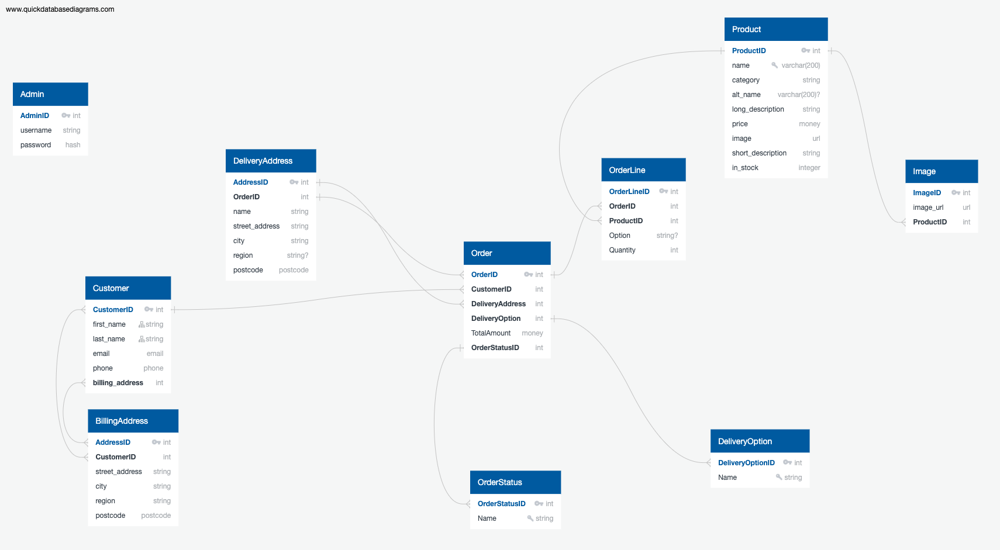
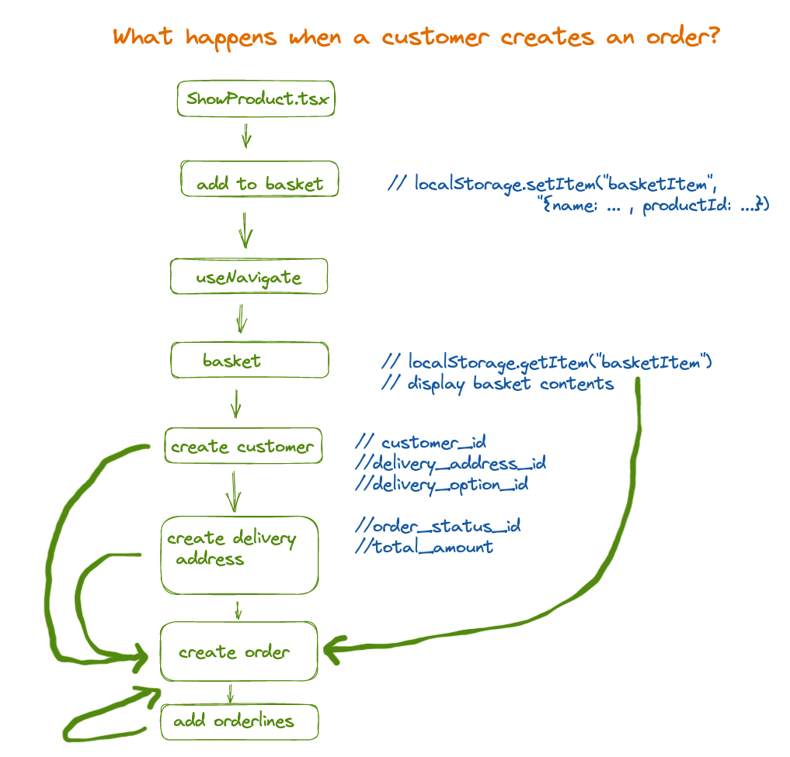
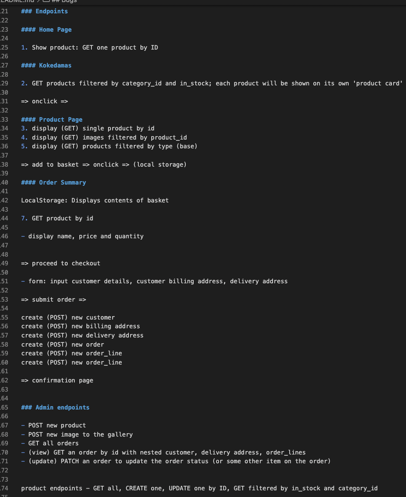
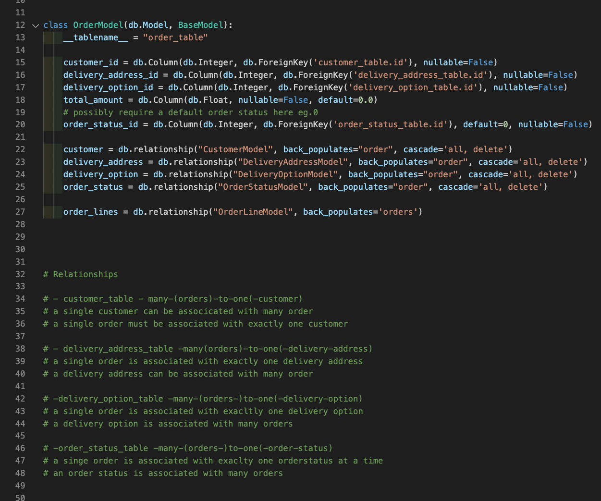
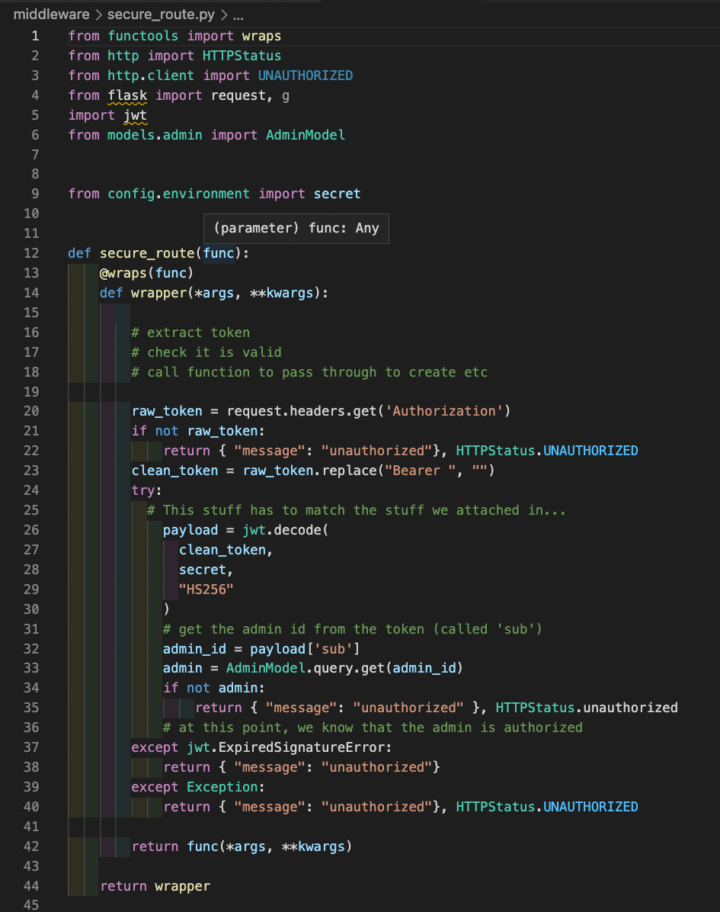

## Description

This is an e-commerce application for O'Kedama a small plant and flower business based in East London. It consists of a PostgreSQL database hosted on bit.io, a Python/Flask API and a TypeScript/React frontend. Visitors can view the products, enter customer and delivery details and place an order. The administrator can post and update products as well and viewing and managing orders from the admin GUI.  This was the final project for my Software Engineering Immersive course with General Assembly.

## Deployment

The project is deployed [here](https://okedama.netlify.app/) at the O'Kedama website, where you can also see the beautiful plants that O'Kedama offers. 

## Instructions for running this project locally

- Fork this repository
- Clone your forked repository
- Run `npm i`from the root directory to install the dependencies
- Run `npm run dev` to run the frontend locally
- Fork the botany-frontend repository
- Clone your forked repository
- Make sure that pipenv is installed and up-to-date
- Run `pipenv install` to install the dependencies
- Seed the local project with the command `run python seed.py`
- Run `pipenv run flask run` to run the backend

## Timeframe and Working Team

- This was a solo project, which I completed over 2 weeks, working part-time.  

## Techonologies 

- Python/Flask
- PostgreSQL 
- Marshmallow
- TypeScript/React
- CSS/HTML
- Docker
- JsonWebToken (JWT)
- Bcrypt

## Brief 

- to build a full-stack application, consisting of a Python Flask API consumed by a separate React frontend
- The project should be a complete product, with multiple relationships and CRUD functionality for at least two or three models
- implement thoughtful user stories/wireframes that are significant enough to show which features are core MVP adn which can be considered stretch goals
- include a visually impressive design
- be deployed online

## Planning

1. I created a plan for the database and relationships between the various tables on QuickDBD.  

2. I used excalidraw to create a basic flow for the user.  In particular, I planned the sequence in which the order details must be added to the database in order to successfully post an order.  

3. In the first instance, I planned the following endpoints for my MVP However, during the course of the build, I realised that there were a couple of others I had not considered, and which I added later.  

## Building 

### Backend

1. I started by creating a basic backend using Python and Flask, and testing it locally using Insomnia.  

2. I built the models for my products and images with a one-to-many relationship between the two tables (each image is associated with exactly one product). I built made a seed.py program to enable easy testing while building my models.  My QuickDBD diagram was extremely helpful as a starting point for the models and as a guide for creating the relationships between tables.  

3. Once the seeding was working correctly, I went on to build the controllers and serializers. The visitor side of the website required a small number of routes and these were very straightforward. For the admin side, I found the admin [user stories](stories.md) helpful in deciding which routes were needed.

3. Building the models and relationships was one of the more involved parts of the build and I encountered several minor bugs as well as one major bug, which I have detailed below. The seed.py program was helpful for this, allowing me to test my models and relationships before moving on to build the serializers and controllers.  

4. The most complicated model was the order.py model because this is the table that links most of the other tables -  customer, delivery address, order-line, delivery option - together. However, the planning I had done for the database had given me a clear idea of how the relationships should work. In the end, it looked like this: 

5. I created a secure_route decorator using JsonWebToken and bcrypt, which allows the admin to log into the sight and securely post and update the product table, as well as viewing and updating orders, storing and retrieving customers and delivery addresses.  I added this decorator to all of the admin controllers.  

#### Bugs 

When I was programming the image model, I was seeding the project regularly in order to test it. Unexpectedly, I recieved an error I didn't recognise: 
raise AttributeError(key)
AttributeError: columns

I read the full text of the error in order to understand where in my code I had introduced it. I examined all the files that were named in the error one by one, however, I had not made changes to these files and I could not see how the code I had written (the new ImageModel) was affecting these files.  

After examining the error and my code, I looked for this error on StackOverflow and elsewhere. At first glance there was nothing relevant to the code I was writing.  

I removed the code I had written since the code had broken (it was only a few lines) and added it again.  I identified the exact line of code that was causing the error - in the ProductModel class in models.product, when I added the relationship between the ProductModel and the ImageModel. However, I could not understand how this line of code was raising the error.

I remembered that I had been prompted to install marshmallow-sqlalchemy during this process. I checked my dependencies against an earlier version of my code (I had used the * operator in my pipfile so that my dependencies were updating automatically).  

I saw that sqlalchemy had updated to a new version. I changed it back to the previous version and found that my code now worked as intended. It appeared that the update was breaking my code. I later realised (because others started to reference the same problem online) that this was indeed the case.  

In future will consider the advantages and disadvantages to using automatic upgrades or fixed versions for my dependencies.  

### Frontend

1. Building a basic frontend (visitor GUI and admin GUI) for the O'Kedama web app was relatively straightforward, using TypeScript/React. I had chosen to avoid using a visitor login for my MVP in order to make ordering as simple as possible for the visitor. This brought security considerations and I made some use of local storage in order to avoid unsecured GET requests to retrieve the customer and delivery details at various stages of the ordering process.

#### Bugs

2. I realised that adding an orderline to an order at the end of the ordering process would be a challenge as the order must be saved to the order table first and the orderId returned so that it could be posted within the orderline.  I decided to add an extra 'building your order' page to the order process in order to separate the POST request for the order and the POST request for an orderline.  However, I suspect that there might be other ways to solve this problem and will research these. 

### Challenges and Wins

- This was a consolidation project and the biggest challenge lay in the planning, that is, working to understand where the complexity would lie before beginning the build.  QuickDBD was very helpful for this (see planning). Making sure that the relationships were correct and functioning smoothly was the longest part of the project.  For example, there is a persisting bug with the gallery (not yet built): when a new image is posted, an error is displayed: 'product_id' unknown field.  It seems as if the image is being created before the product, and then the product_id is not there to be added to the new gallery_image. However, the product is already in the database. This is just one example of where the complexity of the relationships in the database has taken time to resolve.  
- This is the first project I have built using Python, so I was learning the language as I went along. Chat GPT has been a superb resource in learning the syntax and beginning to explore all that Python has to offer. 
- On the frontend, I made use of several forms in order to allow the admin to POST products and to allow the customer to POST details and order.  It has been useful to practice building these components in React. I have not been able to make use of structured clones as I would like to, because of a bug I have not been able to resolve, and have had to depend on the [spread operator](screenshots/spread-operator.png) where I would prefer a structured clone.
   

### Key Learnings

- Practical experience of building a relational databases has given me a deeper understanding of their utility and complexity
- Experience working with Python/Flask, and an understanding of some key differences between this framework and NodeJS/Express
- Once again, the importance of detailed planning, with special focus on those areas of maximum complexity; in this case, the POST request to the order table
- Introduction to decorators and some of their uses

### Future Improvements

- Although the backend functionality is working well, there is still work to do on the frontend in order to confirm that an order has been sent
- Order summary should be sent as an email to the admin after it is posted to the database, and an order confirmation page should be added for the customer
- Review of how customer information is held, in order to make sure that it is secure
- Using Cloudinary widget on the admin side to allow admin to upload her own photographs to the website 

